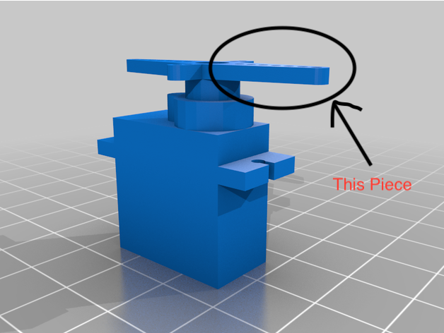

# Robotics Blog 

## 12/10/23: The Beginning of the End - Everything Important that happened in the last 3 weeks

### Overveiw

This Blog is the overview for the last week of last term, as well as any important that happened over the Holidays (Not Very Much). 

### Last week of school

I do not remember if I have written about this yet, but I will here. 

In the last couple of weeks of last term, I was designing the possibly useful wrist mechanisim, and found no majorly glaring issues, but soon after I found that connecting the actuators to a servo would be difficult as the prong for the servo, This Thing:

Is not long enough to connect to the actuators under the wrist piece, and I need to create a piece for this, so I designed one of these

    

### During The Holidays

I sent this model to my local 3D printing factory (My friend who has a 3D Printer), and then fell into a deep slumber for the rest of the two week period (Worked on other things).

### Plan for the first week of this Term

At the time of writing this blog, I am several days into the first week of the term. I have the printed piece, and will be testing it throughout the week. If it does work how I imagine it, or I get bored of the idea, I will try to implement thumb rotation.

The project due date is in sight. This is both exciting and nerve-wracking, mainly because of the presentaion that accompanies the finishing of the project.

For the Presentation, I will be presenting a blog... I think