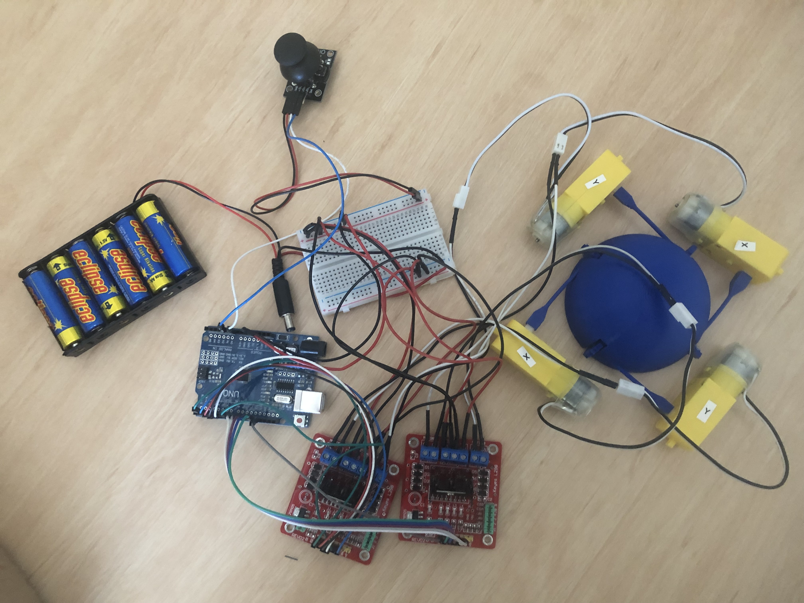
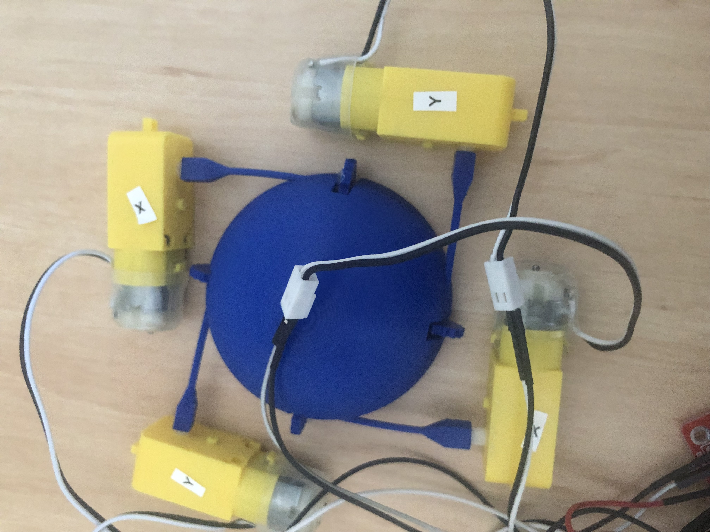
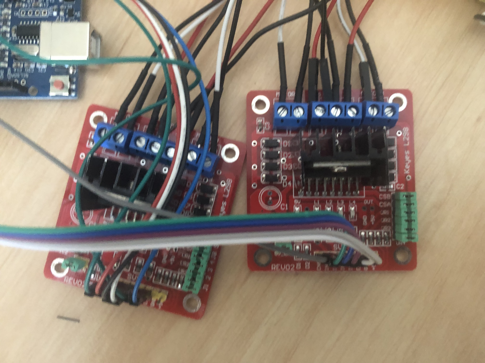
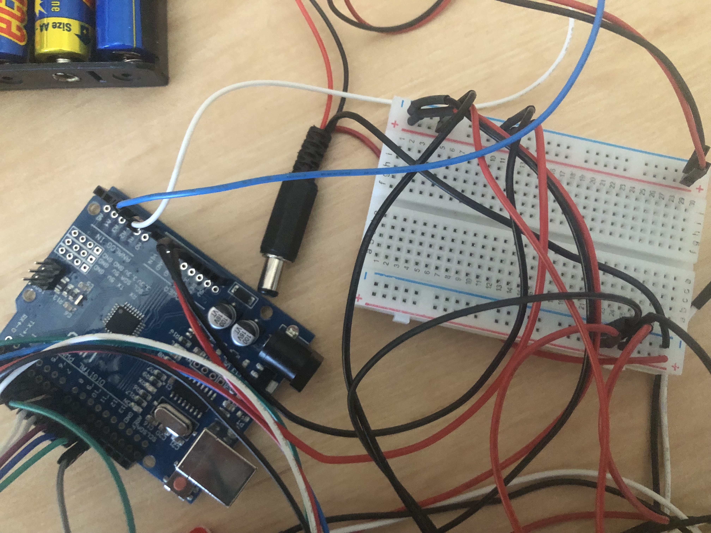
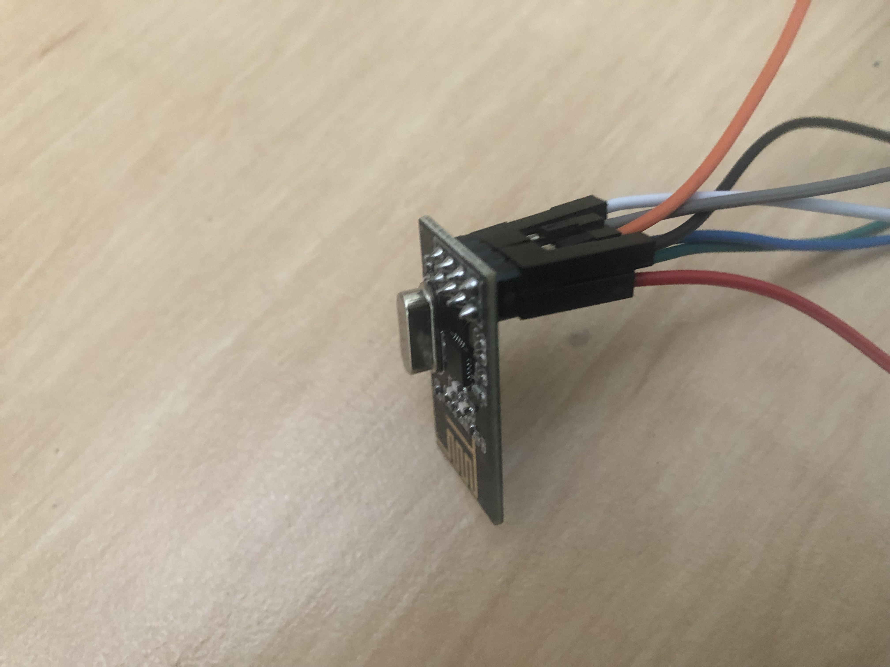
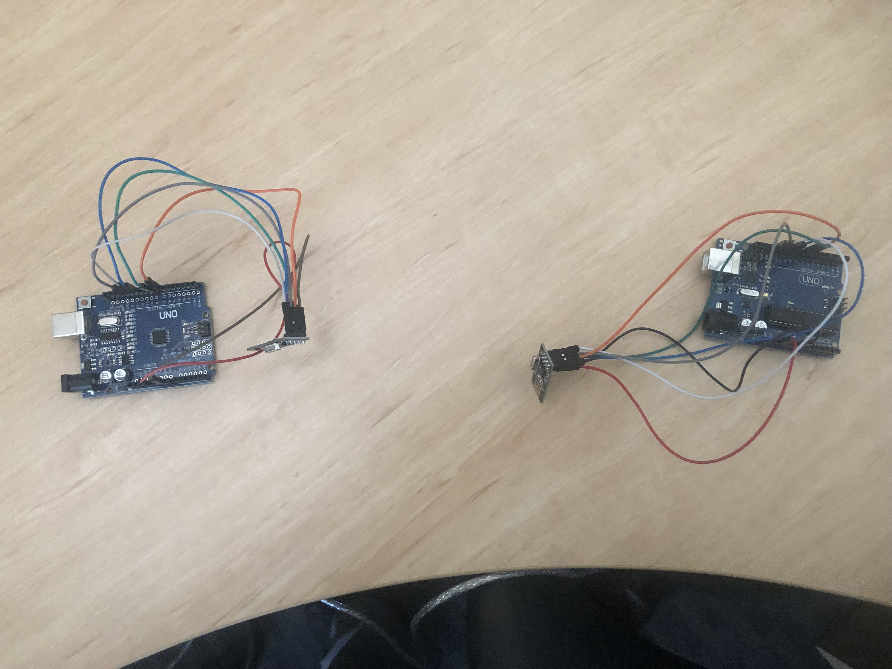

# Robotics Blog 

## 8/5/23: An excelent progress Blog

### Overveiw

Excelent progress for dome this week, started working on wireless connection.

The problem I found last week

### Project Domer

This is the prototype that I have so far. I dont have any housing for the electronics, nor any capacity to disconect it from my computer, I have solved some other problems.

This is the main robot body, the x and y axis motors are 

<video src="../Images/IMG_0314.mp4" controls="controls" style="max-width: 730px;">
</video>

### In Conclusion and plan for the future

 